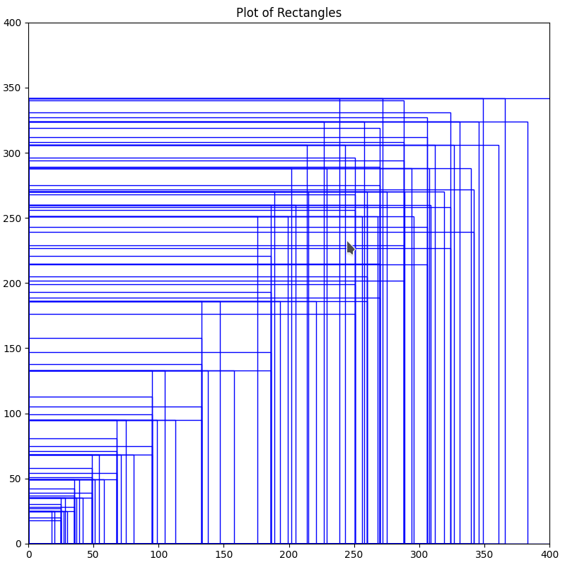

# Dexter's Laboratory Facial Detector Algorithm Description

## 1. Dataset Generation

To train the facial detector, I have implemented two main classes for generating positive and negative examples: `PositiveExampleGenerator` and `NegativeExampleGenerator`. This section briefly describes the data generation process.

### Positive Examples
Generating positive examples is a simple and straightforward process:

1. The annotations are read from the `{character}_annotations.txt` files.
2. For each annotation, the region of interest (ROI) containing the character's face is extracted.
3. Random padding (up to 10% of image dimensions) is applied around the ROI to include more context, which improved detection accuracy from 0.642 to 0.764 mAP.
4. The image is resized to the standard size (defined in the params file - `64x64`).
5. The conversion to grayscale is applied.
6. The resulting images are saved in the corresponding character's directory (i.e `data/positive/{character}`)

### Negative Examples
For negative examples, the process is more complex and involves:

1. Scan images using sliding windows of randomly chosen sizes.
2. Check overlap (IoU) with positive regions, ensuring IoU < 0.3.
3. Select and save non-overlapping regions.
4. Resize and store the selected regions.

## 2. Sliding Windows Generation

The sliding window sizes are generated based on the average ```height / width``` ratio from the annotations:

```txt
dad - Average Height/Width Percentage: 118.30%
unknown - Average Height/Width Percentage: 102.20%
dexter - Average Height/Width Percentage: 79.68%
deedee - Average Height/Width Percentage: 70.14%
mom - Average Height/Width Percentage: 107.08%
```

A predefined set of window sizes is generated based on the ```height / width``` ratios, using ```25px``` as the fixed reference point. To ensure proper detection of rotated faces, both ```(width, height)``` and ```(height, width)``` pairs are included in the initial set:

```py
def get_initial_window_sizes():
    return [(25, 30), (30, 25),
            (25, 18), (18, 25),
            (25, 27), (27, 25),
            (25, 20), (20, 25),
            (25, 25)]
```

To generate additional window sizes, a while loop is used to scale the initial windows by a factor until they exceed a predefined maximum size (75% of the image dimensions). This preserves the original ```height / width``` ratios while progressively increasing the window size.

```py
def generate_scaled_window_sizes(height, width, scale_factor):
    max_height = int(height * 0.75)
    max_width = int(width * 0.75)
    
    min_window_sizes = get_initial_window_sizes()
    window_sizes = set()

    for min_window in min_window_sizes:
        current_window_w, current_window_h = min_window
        while current_window_w <= max_width and current_window_h <= max_height:
            window_sizes.add((current_window_h, current_window_w))
            current_window_w = min(int(current_window_w * scale_factor), width)
            current_window_h = min(int(current_window_h * scale_factor), height)

    return window_sizes
```

Since the previous scaling approach may overlook larger window sizes, an additional loop is used to generate windows covering a range from ```70%``` to ```95%``` of the image width. These widths are adjusted using the precomputed ```height/width``` ratios for better coverage:

```py
for width_percentage in range(95, 69, -5):
    curr_width = int(width * (width_percentage / 100))
    for scale in [1.1830, 1.0220, 0.7968, 0.7014, 1.0708]:
        curr_height = int(curr_width * scale)
        window_sizes.add((curr_width, curr_height))
        window_sizes.add((curr_height, curr_width))
```

This approach ensures a diverse and comprehensive set of sliding window sizes for the facial detection algorithm, balancing coverage and efficiency:



## 3. FacialDetector Class Implementation

The FacialDetector class implements a sliding window-based detection system that utilizes Support Vector Machine (RBF kernel) for binary classification of face versus non-face regions. The SVM is trained using positive examples (face regions of all characters) and negative examples (non-face regions) to learn this binary distinction. The detection pipeline operates by sliding multiple windows of varying sizes across input images, extracting HOG features from each window, and applying SVM classification to identify potential face regions. The system then employs Non-Maximal Suppression (NMS) to filter overlapping detections, ensuring optimal face localization.

The detection process follows these key steps:
1. Generates windows of multiple sizes based on character face sizes
2. Slides these windows across the image with a fixed stride (i.e ```16px```)
3. For each window:
   - Extracts HOG (Histogram of Oriented Gradients) features
   - Applies SVM classifier with RBF kernel to determine face presence
   - Computes detection confidence score and retains windows where the score exceeds a predefined threshold
4. Applies Non-Maximal Suppression to eliminate redundant overlapping detections
5. Performs final character classification on the detected regions

To optimize processing time, the system implements parallel execution using multiple processes. It spawns a number of worker processes equal to the available CPU cores, dividing the image batch among them. Each process handles its assigned subset of images independently, communicating results back through a shared queue. This parallel processing approach significantly reduces the overall execution time compared to sequential processing.

## 4. Character Face Classification

The face classification system consists of two main components:
- ```CharacterDataset```: Manages the training data by loading face images, converting them to grayscale, normalizing them (zero mean, unit variance), and mapping characters to numerical indices (dexter, mom, dad, deedee, unknown).
- ```CharacterFaceClassifier``` implements face classification using an SVM with an RBF kernel. It handles class imbalance with balanced weights and persists the trained model for efficient reuse.

```py
model = SVC(
    kernel='rbf',
    C=10.0,
    gamma='scale',
    class_weight='balanced',
    random_state=42
)
```

### 5. YOLO-based Implementation

The YOLO-based implementation utilizes the ```YOLOFacialDetector``` class to handle both face detection and character classification tasks. The system uses the YOLOv8 architecture for efficient, single-stage detection and classification.

#### Data Processing and Format

YOLO expects annotations in a normalized format where all coordinates are relative to the image dimensions, making the format independent of image size. Each bounding box is represented by:
- ```x_center, y_center```: The normalized coordinates (between 0 and 1) of the box's center point
- ```width, height```: The normalized width and height (between 0 and 1) of the box

The dataset preparation involves converting the original annotations into YOLO format:

```py
def _create_yolo_label(self, label_path, class_idx, bbox, img_path):
    with open(label_path, 'a') as f:
        img = cv.imread(img_path)
        height, width = img.shape[:2]
        
        x1, y1, x2, y2 = bbox
        
        # Convert to YOLO format (normalized)
        x1 = x1 / width
        x2 = x2 / width
        y1 = y1 / height
        y2 = y2 / height
        
        x_center = (x1 + x2) / 2.0
        y_center = (y1 + y2) / 2.0
        bbox_width = x2 - x1
        bbox_height = y2 - y1
        
        # <class> <x_center> <y_center> <width> <height>
        f.write(f"{class_idx} {x_center:.6f} {y_center:.6f} {bbox_width:.6f} {bbox_height:.6f}\n")
```

The dataset structure is defined using a YAML configuration:
```py
data_yaml = {
    'path': os.path.abspath(self.data_dir),
    'train': 'train/images',
    'val': 'val/images',
    'names': {i: char for i, char in enumerate(self.characters)},
    'nc': len(self.characters)
}
```

The training process uses *YOLOv8's* predefined training pipeline with the following configuration:
```py
model = YOLO('yolov8n.pt')
results = model.train(
    data=f"{self.data_dir}/data.yaml",
    epochs=200,
    imgsz=64,
    batch=16,
    name='dexter_laboratory_face_detection',
)
```

The YOLO implementation achieves superior performance compared to the sliding window approach:
- Task 1 (Face Detection): ```0.92``` mean average precision
- Task 2 (Character Classification): ```0.96``` mean average precision